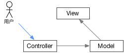
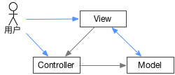

# MVC
====

MVC模式最早由Trygve Reenskaug在1978年提出，是施乐帕罗奥多研究中心（Xerox PARC）在20世纪80年代为程序语言Smalltalk发明的一种软件架构。MVC的三个字母含义如下：

* M: Model，模型负责数据部分
* V: View，视图负责界面部分
* C: Controller，控制器负责业务逻辑部分

三者交互关系如下图：

在实际使用中，需要加入用户交互，用户介入点有两个。从视图和从控制器进入，分别如下：

用户操作视图层，这种方式不会改变MVC种三者的通讯方式。

用户操作控制器层，在这种模式下，视图和控制器之间的通讯就不再需要了。控制器通知Model更新数据，然后视图中重新呈现修改后的数据即可。这种方式的操作流图看上去很完美，但实际使用中很难做到，怎么可能用户完全不操作界面呢？这太难了。

上面两种是理论上的模式，实际使用中有时会出现更加复杂的模式，例如下面这种：

用户和view、controller都有交互，并且view和model之间双向通讯。

简单才是天才们追寻的终极目标，由于实际中的MVC太过复杂，后来人们提出了新架构来改善它。
