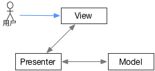

# MVP
----

MVP (Model-View-Presenter)，是对MVC模式进行的改进，最初由Taligent公司提出的概念。

在MVP种，用Presenter代替了MVC中的Controller。

从图上可以看出来，在MVP中，视图和模型完全分开，不再直接进行通信，这样做的好处是解耦，更方便做单独的视图组件。

Presenter可以看作是View和Model之间的中间人，除了基本的业务逻辑外，还需要大量代码处理从View到Model和从Model到View的数据进行“手动同步”，这样Presenter显得很重，不便维护。而且由于没有数据绑定，如果Presenter对视图渲染的需求增多，它不得不过多关注特定的视图，一旦视图需求发生改变，Presenter也需要改动。

为了改进MVP中Presenter的缺点，有人提出了MVVM。

> MVP是很多短语的缩写，在不同的场合下有很多不同的含义，它可能是：
> 最有价值的球员(Most Valuable Player)；
> 微软最有价值专家 (Microsoft Most Valuable Professor，简称MVP)；
> 最简可行产品(Minimum Viable Product)，产品开发中的专用术语，指有部分机能，恰好可以让设计者表达其核心设计概念的产品；
> 医学中的一种心脏疾病：僧帽瓣脱垂（Mitral Valve Prolapse）；甚至2017年韩国出道的一个乐队也自称MVP来凑热闹。