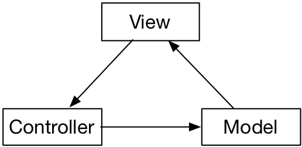

# 项目目录结构
----

node_modules目录是存放的已经安装的node包，一般不要管它即可，这个目录也不会被提交到git中（.gitignore有设置）

public目录下默认有2个文件index.html和favicon.ico。

* index.html是整个项目的模版页面，可以根据需要修改。如果你的项目是对应手机版的，要修改这里增加viewport设置，修改title，或者链接外部网站的css/js等。
* favicon.ico是为浏览器提供网页的图标。根据需要改成自己的图标，网上有很多在线做格式转换的工具，可以把图片转成这种ico文件。

src目录是我们工作的主要目录，所有的源码都在这了。

* assets子目录存储些静态文件，比如图片。
* components 是自定义的vue控件存放目录
* views 是项目中使用的页面/视图存放目录，默认创建的Home.vue和About.vue就在这里
* App.vue是整个项目的vue模版
* main.js是可以修改全局设置
* router.js 如果使用了vue-router，则会有这个文件，修改路由表在这里

继续看工程根目录下的几个文件：

* balel.config.js
* package-lock.json
* package.json
* vue.config.js 默认不会创建这个文件，这个是根据需要自己手动创建的

另外还可自己创建环境变量配置文件。
